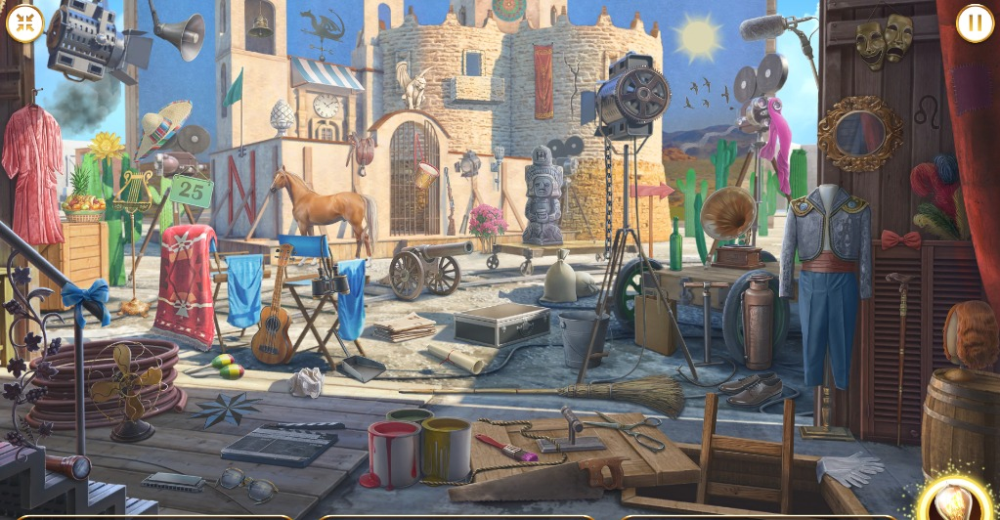
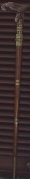
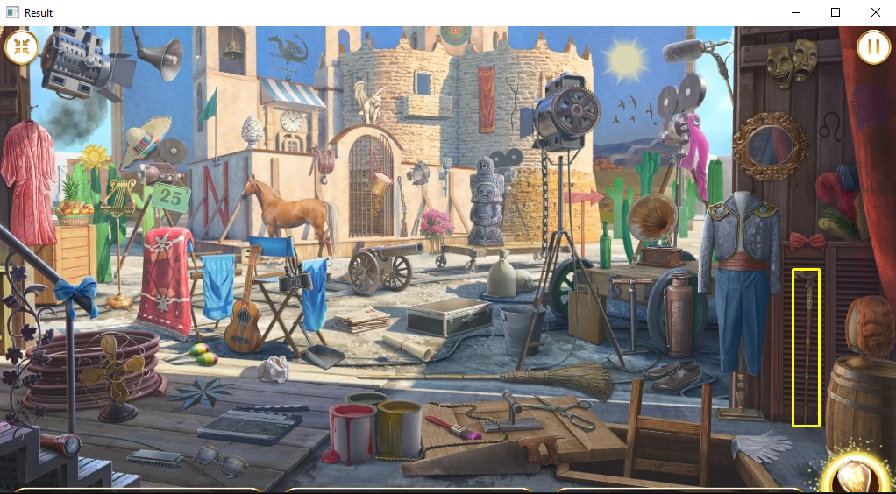

# Find objects with Python

## Libaries used

- OpenCV -> https://pypi.org/project/opencv-python/
- numpy -> https://pypi.org/project/numpy/

## Installation

- pip install opencv-python
- pip install numpy

## Results

### Image used to look for the object

### Image of the object in the image_to_look

### Image of the result when run the code

